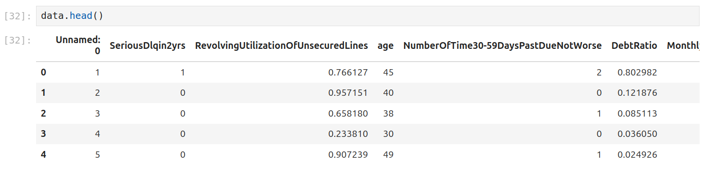

Ensemble Techniques and Boosting 
================================
In this module we introduce the concept of ensemble methods in Machine Learning and describe 
in detail boosting and the Adaptive Boosting algorithm. We then discuss boosting implementations
in scikit-learn. 

By the end of this module, students should be able to:

1. Describe ensemble methods at a high level and when they can be effective. 
2. Implement boosting algorithms such as AdaBoost and Histogram-based Gradient Boosting in 
   scikit-learn. 

Introduction 
------------

Ensemble techniques in Machine Learning are methods that combine multiple, individual models or 
algorithms to produce a single model. We have already seen one example of an ensemble method: the 
Random Forrest Classifier, which combined multiple decision trees into a single estimator. 

Ensemble methods can lead to more robust, accurate and stable 
models. Some of the advantages of ensemble techniques are:

1. *Improved accuracy*: When we combine mutliple models the bias and variance can be reduced, thus 
   leading to overall accurate predictions.

2. *Reduce overfitting*: Complex models are more prone to overfitting. Bagging techniques such as 
   Random forest, which we
   studied in the previous lecture, reduces overfitting by averaging predictions of multiple models on 
   different subsets of data.

3. *Robustness*: Ensemble methods are more robust to noise in the data, as they rely on multiple models that may each perform differently but help each other in terms of generalization.

There are several broad categories of ensemble techniques, including:

1. **Bagging (Bootstrap Aggregation)**: Involves training multiple instances of a model on 
   random subsets of the data and averaging the predictions (e.g., Random Forest).

2. **Boosting**:  Sequentially builds models where each model tries to correct the errors 
   made by the previous one (e.g., AdaBoost, Gradient Boosting).

3. **Stacking** : Combines the predictions of multiple models by training a meta-model to 
   combine them in an optimal way (often with different types of base learners).

Bias and Variance
-------------------

In machine learning, bias and variance are two fundamental sources of error that affects the performance of a model.
Both the errors are seen when the model tries to generalize to predict on the unseen data. The goal is minimize
both bias and variance, to achieve a model that generalizes well.

A model with high *bias* makes strong assumptions about the data and tries to oversimplify the underlying patterns.
This usually leads to **underfitting** as the model fails to capture the underlying patterns in data.

On the other hand, *variance* refers to errors introduced by the model's sensitivity to small 
fluctuations in the training data.
A model with high variance is highly flexible and can fit the training data very well, but it often captures 
noise or random fluctuations in the data rather than the true underlying patterns. This leads to overfitting, 
where the model performs well on the training data but poorly on unseen test data.

Bias-Variance Tradeoff. The relationship between bias and variance is inverse: reducing bias often 
increases variance, and reducing variance often increases bias. 
This is called the bias-variance tradeoff. The key is to find the right balance between 
bias and variance that allows the model to generalize well to new, unseen data. 

Bagging techniques reduces variance, where as boosting reduces both bias.

When to Use Ensemble Techniques:
-----------------------------------

**High Bias (Underfitting)**: Boosting can help by iteratively correcting errors, reducing bias.

**High Variance (Overfitting)**: Bagging (e.g., Random Forest) helps by averaging multiple models trained on different subsets of data, reducing variance.

**Outliers or Noisy Data**: Ensemble methods are often robust to outliers or noisy data because they aggregate the predictions of multiple models.

Boosting Techniques & Strong and Weak Learners 
-----------------------------------------------

Ensemble methods were originally inspired by a theoretical question involving *weak learners* and 
*strong learners*. In the context of a classification problem, a *weak learner* is a model that 
statistically performs just a little better than random guessing. 
Conversely, a *strong learner* 
is a model that can be made arbitrarily accurate, that is, their accuracy can be made arbitrarily 
close to 1. 

In mathematical notation, given any :math:`\delta > 0`, and an :math:`\epsilon > 0`,
for a weak learner we can bound the probability that the error, :math:`e(x)`, is less than :math:`0.5-\epsilon`: 

.. math::
   
   \text{Weak Learner} : Pr( e(x) \leq 0.5 - \epsilon) \leq 1 - \delta

while for strong learners, we can bound the probability that the error is arbitrarily small, i.e., 

.. math::
   
   \text{Strong Learner} :  Pr( e(x) \leq \epsilon) \leq 1 - \delta

Conceptually, one should think of the :math:`\delta` and :math:`\epsilon` as "arbitrarily" small numbers 
(i.e., very close to 0), because they can be chosen to be any positive number. 

The question that was posed was this: given a weak learner model for a specific dataset, can one always find 
a strong learner using an efficient algorithm? To make this question mathematically precise requires a model 
of learning. 

In an astonishing result, Robert Schapire settled the question in the affirmative in a paper 
from 1990 titled "The Strength of Weak Learnability" for the *probably approximately correct* (PAC) model 
of learning [1]. The proof in the paper is constructive in the sense that it describes a method for 
converting a weak learner into a strong learner. In a sense, the key idea is to iteratively have the 
weak learner focus on the hard-to-learn parts of the sample distribution. 

Building upon this work, Freund and Schapire developed *AdaBoost* (Adaptive Boosting) 
in 1995 for which they won the Gödel Prize. 

Boosting 
~~~~~~~~~

The general idea of boosting is to build multiple models sequentially, where each model tries to correct the errors 
made by previous models. The models are trained sequentially and each subsequent model gives more weights to 
the data points that were previously misclassified by the previous model.
The final prediction is the weighted combination of all individual models.

**AdaBoost (Adaptive Boosting)**: In the paper, "Experiments with a New Boosting Algorithm" by Yoav Freund 
and Robert Schapire (1996) a novel
boosting algorithm was proposed, known as the AdaBoost (Adaptive Boosting) which improved the accuracy 
of weak classifiers.
This algorithm was shown to be effective in combining multiple weak learners to create a stronger, more 
accurate classifier. 

AdaBoost trains a series of weak learners in sequence, with each learner focusing on the instances that 
were misclassified by the previous ones.
After each classifier is trained, AdaBoost adjusts the weights of the training instances. Misclassified 
instances get higher weights, so the next weak learner focuses more on these "hard" examples.
After each weak learner is trained, the final prediction is made by a weighted combination of all the 
weak learners' predictions, with more accurate learners receiving higher weights.

AdaBoost in scikit-learn
~~~~~~~~~~~~~~~~~~~~~~~~~

Let's look at implementing Adaboost in sklearn. To illustrate, we'll work with a new dataset on 
credit defaulting. This dataset was originally part of a 3 month long Kaggle competition called 
"Give Me Some Credit" that ran in 2011 [2]. We have made part of the data available from our 
course website, `here <https://raw.githubusercontent.com/joestubbs/coe379L-sp25/refs/heads/master/datasets/unit02/credit.csv>`_. 

As usual, we will import the necessary libraries and load the data as a csv file: 

.. code-block:: python3 

   >>> import pandas as pd
   >>> import numpy as np

   >>> data = pd.read_csv('credit.csv')

We can see from some initial exploratory data analysis that the dataframe contains an index column: 

Let's remove that column: 

.. code-block:: python3 

   >>> data = data.drop('Unnamed: 0', axis=1)

   # confirm that the column is removed
   >>> data.head()

What about missing values? We can use a method like ``info()`` to get a high-level picture: 

.. code-block:: python3
   :emphasize-lines: 13, 18

   >>> data.info()

   <class 'pandas.core.frame.DataFrame'>
   RangeIndex: 150000 entries, 0 to 149999
   Data columns (total 11 columns):
   #   Column                                Non-Null Count   Dtype  
   ---  ------                                --------------   -----  
   0   SeriousDlqin2yrs                      150000 non-null  int64  
   1   RevolvingUtilizationOfUnsecuredLines  150000 non-null  float64
   2   age                                   150000 non-null  int64  
   3   NumberOfTime30-59DaysPastDueNotWorse  150000 non-null  int64  
   4   DebtRatio                             150000 non-null  float64
   5   MonthlyIncome                         120269 non-null  float64
   6   NumberOfOpenCreditLinesAndLoans       150000 non-null  int64  
   7   NumberOfTimes90DaysLate               150000 non-null  int64  
   8   NumberRealEstateLoansOrLines          150000 non-null  int64  
   9   NumberOfTime60-89DaysPastDueNotWorse  150000 non-null  int64  
   10  NumberOfDependents                    146076 non-null  float64
   dtypes: float64(4), int64(7)
   memory usage: 12.6 MB

We see that ``MonthlyIncome`` and ``NumberOfDependents`` both have missing values. 
There are multiple ways to impute these. For now, we will use a simple scheme: 
we'll replace the missing values with the median. 

*Discussion:* The method above is called univariate imputation. Can you think of a 
multivariate approach? 

.. code-block:: python3 

   >>> data['MonthlyIncome'] = data['MonthlyIncome'].fillna(data['MonthlyIncome'].median())
   >>> data['NumberOfDependents'] = data['NumberOfDependents'].fillna(data['NumberOfDependents'].median())

   # check for the desired results 
   >>> data.info()

   <class 'pandas.core.frame.DataFrame'>
   RangeIndex: 150000 entries, 0 to 149999
   Data columns (total 11 columns):
   #   Column                                Non-Null Count   Dtype  
   ---  ------                                --------------   -----  
   0   SeriousDlqin2yrs                      150000 non-null  int64  
   1   RevolvingUtilizationOfUnsecuredLines  150000 non-null  float64
   2   age                                   150000 non-null  int64  
   3   NumberOfTime30-59DaysPastDueNotWorse  150000 non-null  int64  
   4   DebtRatio                             150000 non-null  float64
   5   MonthlyIncome                         150000 non-null  float64
   6   NumberOfOpenCreditLinesAndLoans       150000 non-null  int64  
   7   NumberOfTimes90DaysLate               150000 non-null  int64  
   8   NumberRealEstateLoansOrLines          150000 non-null  int64  
   9   NumberOfTime60-89DaysPastDueNotWorse  150000 non-null  int64  
   10  NumberOfDependents                    150000 non-null  float64
   dtypes: float64(4), int64(7)
   memory usage: 12.6 MB

At this point we are ready to train a model. We'll use the standard procedure: 

1. Create ``X`` and ``y`` 
2. Split Data 
3. Fit across a grid of hyperparameters. 
4. Evaluate the model's performance. 

In this case, we'll 

.. code-block:: python3 

   >>> from sklearn.model_selection import train_test_split
   >>> X = data.drop('SeriousDlqin2yrs', axis=1)
   >>> y = data['SeriousDlqin2yrs']

.. code-block:: python3 

   >>> X_train, X_test, y_train, y_test = train_test_split(X, y, test_size=0.3, stratify=y, random_state=1)

In the code below, we create a parameter grid search space that includes the learning rate and the number 
of estimators --- in this case, the number of decision trees. with this size of search space, the call to 
``fit()`` will take around 1 minute. (Note the use of ``n_jobs`` in the ``GridSearchCV`` constructor.)

.. code-block:: python3 

   from sklearn.ensemble import AdaBoostClassifier
   from sklearn.tree import DecisionTreeClassifier
   from sklearn.model_selection import GridSearchCV

   decision_tree_stump = DecisionTreeClassifier(max_depth=1)

   param_grid = {
      'learning_rate': [0.1, 0.5, 1.0],
      'n_estimators': [50, 100, 200]
   }

   abc = AdaBoostClassifier(estimator=decision_tree_stump, random_state=42)
   grid_search = GridSearchCV(abc, param_grid, cv=3, n_jobs=8)
   grid_search.fit(X_train, y_train)

Here we use the classification_report to report the model's performance. In this case, we focused on 
accuracy. 

.. code-block:: python3 

   from sklearn.metrics import classification_report
   test_report = classification_report(y_test, grid_search.predict(X_test))
   train_report = classification_report(y_train, grid_search.predict(X_train))
   print(f"Performance on TEST\n*******************\n{test_report}")
   print(f"Performance on TRAIN\n********************\n{train_report}")

We see the accuracy performance on TEST and TRAIN are both excellent, 94% on each: 

.. code-block:: console

   Performance on TEST
   *******************
               precision    recall  f1-score   support

            0       0.94      0.99      0.97     41992
            1       0.59      0.16      0.25      3008

      accuracy                           0.94     45000
      macro avg       0.77      0.57      0.61     45000
   weighted avg       0.92      0.94      0.92     45000

   Performance on TRAIN
   ********************
               precision    recall  f1-score   support

            0       0.94      0.99      0.97     97982
            1       0.60      0.15      0.24      7018

      accuracy                           0.94    105000
      macro avg       0.77      0.57      0.61    105000
   weighted avg       0.92      0.94      0.92    105000   

References and Additional Resources
-----------------------------------

1. Schapire, Robert E. (1990). "The Strength of Weak Learnability" (PDF). 
   Machine Learning. 5 (2): 197–227. CiteSeerX 10.1.1.20.723. doi:10.1007/bf00116037. S2CID 53304535. 

2. Kaggle competition: Give Me Some Credit. https://www.kaggle.com/competitions/GiveMeSomeCredit/data 