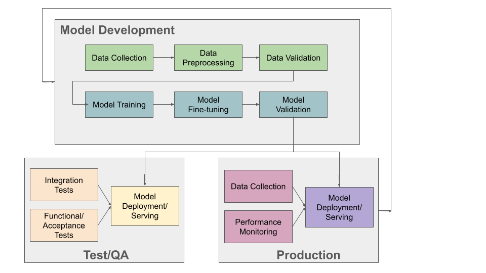

MLOps
=====

In this module, we introduce concepts and techniques related to MLOps, that is, 
the automation of operations involved in building, validating and deploying 
ML pipelines for applications. By the end of this module, students should be able to:

* Describes the basics of the entire ML application workflow and lifecycle. 
* Implement deployment automation for an arbitrary ML model using Python, Flask, and Docker. 
* Implement deployment automation for Tensorflow models using Tensorflow serving. 

The ML Lifecycle and MLOps 
---------------------------

Just like any other software, applications developed with machine learning are 
products that evolve over time. We repeatedly update the software as we gather more data, 
develop better models, and generally make improvements. 

MLOps is a modification of the concept of DevOps, a set of techniques and best practices 
that originated in the late 2000s with the organization of DevOpsDays (2009) and related 
events. DevOps is a combination of the terms *software development* and *IT operations*, 
and the idea was to shorten the time between when new software features were developed 
(i.e., new code being written) and when those features would be released and available 
to users. In order to shorten that time window, a number tasks needed to be automated, 
including:

* Building/compiling software binaries, and/or assembling software packages. 
* Running tests on the new software to ensure it was high quality. 
* Integrating the software with other components in the ecosystem (e.g., other microservices
  in a microservice architecture) and running integration tests across the entire system. 
* Deploying the tested code to production. 

MLOps modifies the concept to DevOps concept to accommodate the processes involved with 
building and deploying new ML applications. At a high-level, the life cycle consists of: 

1. *Data collection and preprocessing:* as we have seen, large amounts of high-quality 
   data is essential to training models that can make accurate predictions. 
2. *Model training:* Once we have gathered and preprocessed data, we train our model. 
   As we have seen, this can involve lengthy executions to search across different model 
   types and hyperparameter spaces. 
3. *Model evaluation and validation:* As we train new versions of our model, we evaluate 
   them using various metrics (e.g., accuracy, precision, recall, F1, etc.). Beyond 
   evaluating models against specific metrics, a number 
   of additional validation steps can be taken, including: *automated testing*, to ensure 
   the application works as intended on important and/or edge cases; *fairness/bias assessment*, 
   for example, by evaluating your model against a separate hold out dataset that is specifically 
   engineered to ensure that it is representative and inclusive of all perspectives. 
4. *Model deployment:* after a model version has been validated, we are ready to package and 
   deploy it, either to a pre-production environment such as a test of QA environment, or to 
   production. 
5. *Integration Testing, Acceptance Testing, and other automated testing:* typically, the trained 
   mode is first deployed to a test or QA environment where automated tests are run. 
   Various kinds of tests could be run, including integration tests (to test the ML model's 
   integration into the rest of the application), functional or acceptance testing, to evaluate 
   high level functions of the application, and performance and/or load testing, to ensure the application 
   perfoms well under various loads. If the testing produces acceptable results, the model is 
   then deployed to production. 
6. *Production Monitoring:* once an ML model has been deployed to production, it must be monitored 
   just like any other application component. The model will see new data samples in production, 
   and these should be collected and evaluated. Various changes in the environment, referred to as 
   *drift* can cause model performance to degrade. For example, some facial recognition systems 
   saw preformance degradation during the pandemic as a result of people wearing masks. Language 
   models see performance degradation over time due to the introduction and use of new words.  

    The ML Application Development and Operations Lifecycle

So far in this course, we have mostly focused on 1), 2) and 3). Below, we discuss specific techniques for
Model Deployment. 

Model Deployment 
-----------------
There are a number of considerations when planning a model deployment. At a minimum, the software must 
be packaged and delivered in a way that allows it to be utilized by the rest of the application. 

Inference Server 
^^^^^^^^^^^^^^^^
The concept of an *inference server* has gained traction in the ML community. The idea is to wrap the 
trained ML model in a lightweight server that can be executed over the network. Commonly, this is done 
either as an HTTP 1.x/REST API or an HTTP 2/gRPC server. 

For example, a REST API inference server for the model we developed to classify images with clothes objects 
may have the following endpoints: 

+---------------------------------+------------+---------------------------------------------+
| **Route**                       | **Method** | **What it should do**                       |
+---------------------------------+------------+---------------------------------------------+
| ``/models/clothes/v1``          | GET        | Return basic information about v1 of model  |
+---------------------------------+------------+---------------------------------------------+
| ``/models/clothes/v1``          | POST       | Classify clothes object in image payload    |
|                                 |            | using version 1 (v1) of the model.          |
+---------------------------------+------------+---------------------------------------------+

When a client makes an HTTP POST request to ``/models/clothes/v1`` they send an image as part of the 
payload. The inference server must:

1. Retrieve the image out of the request payload. 
2. Perform any preprocessing necessary on the image byte stream. 
3. Apply the model to the processed image data to get a classification result. 
4. Package the classification result into a convenient data structure (e.g., JSON).
5. Send a response with the classification data structure included as the message body.  

As you can see, we have encoded both the kind of model ("clothes") as well as the version ("v1") into 
our URL structure. This means that if we developed another model, for example, our handwritten digits 
classifier, we could easily add it to our inference server. We could also easily add a new version of 
the clothes model and serve both at the same time. 

There are a number of advantages to using an inference server architecture, many of which are just the 
advantages enjoyed by all HTTP/microservice architectures: 

1. *Framework agnostic:* Regardless of which ML framework your model is developed in, it can be packaged 
   into an inference server. With that said, some solutions are framework-specific. In fact, one of the 
   solutions we'll look at is Tensorflow Serving, which serves Tensorflow models (and other kinds of 
   *servables*). 
2. *Language agnostic API:* Components of the application can interact easily with the inference server, 
   regardless of the programming language they are written in, because all modern languages have an HTTP 
   client. 
3. *Scalability:* Multiple components of the application can interact with the model inference server, 
   even from different computers. Additionally, multiple instances of the inference server itself can 
   be deployed to increase the throughput of inferences. 
4. *Plug-and-play and model chaining:* The concept of *plug-and-play* for ML models is the idea or goal
   of enabling different models to be "plugged" into an application with little to no code changes to 
   the rest of the application. In order to achieve this, different models that perform the same (or similar)
   task must conform to a common interface. An HTTP interface is one possible mechanism. Similarly, 
   *model chaining* is the idea that we can feed outputs of one model as inputs to another model. For example,
   we may have one model that finds language characters in an image and another model that translates 
   words from one language to another (for example, 
   `Google image translate <https://support.google.com/translate/answer/6142483?hl=en&co=GENIE.Platform%3DDesktop>`_). 
   If individual models use HTTP requests and responses, the responses from one model can be easily fed into 
   as a request to the next model. 
5. *Versioning:* There are multiple, intuitive ways to version a model inference server. One which was suggested 
   above is to use the URL to encode the version. These methods will be familiar to most developers, as REST 
   APIs (and HTTP services more generally) have become common in cloud computing. 

What do we need to build an ML inference server? The basic ingredients are as follows: 

1. *Serialize and deserialize trained models* --- we saw how to do this with sklearn, but we will quickly 
   see how to do this with Keras. 
2. *Write the inference server code* --- we will see two methods for doing this, including a "generic" 
   method using flask and a Tensorflow-specific method (Tensorflow Serving)
3. *Package the server as a docker container image* --- This will simplify deployment and make our server 
   more portable. 
4. *Deploy the server as a container* --- We can use a simple script, docker-compose, or something more 
   elaborate such as Kubernetes. 

Serializing and Deserializeing Tensorflow Models
------------------------------------------------
In Unit 2 we showed how to use the Python pickle module to serialize a skelearn model. For serializing a 
Tensorflow model, we recommend using the built in ``model.save()`` method. In general, attempting to use
pickle on Tensorflow models can lead to errors related to model objects not being pickleable. 

We'll illustrate the techniques in this section using a model trained against the MNIST fashion
dataset. Recall that dataset consisted of 28x28 grey scale images containing different articles of clothing, 
and our goal was to build a model that could perform image classification to determine the type of clothing 
in the image. 

We built a few different model architectures. Here I will work with the LeNet-5. We collect the essential
code for building the model below: 

.. code-block:: python3

   import keras
   from tensorflow.keras.datasets import fashion_mnist
   from tensorflow.keras.utils import to_categorical
   # Importing all the different layers and optimizers
   from tensorflow.keras.layers import Dense, Dropout, Flatten, Conv2D, MaxPooling2D, AveragePooling2D
   from keras import layers
   from keras import models
   from tensorflow.keras.optimizers import Adam
   from keras.applications.vgg16 import VGG16

   # data load 
   (X_train, y_train), (X_test, y_test) = fashion_mnist.load_data()

   # normalize
   X_train_normalized = X_train / 255.0
   X_test_normalized = X_test / 255.0

   # Convert to "one-hot" vectors using the to_categorical function
   num_classes = 10
   y_train_cat = to_categorical(y_train, num_classes)

   # Intializing a sequential model
   model = models.Sequential()
   # Layer 1: Convolutional layer with 6 filters of size 5x5, followed by average pooling
   model.add(Conv2D(6, kernel_size=(5, 5), activation='relu', input_shape=(28, 28, 1)))
   model.add(AveragePooling2D(pool_size=(2, 2)))

   # Layer 2: Convolutional layer with 16 filters of size 5x5, followed by average pooling
   model.add(Conv2D(16, kernel_size=(5, 5), activation='relu'))
   model.add(AveragePooling2D(pool_size=(2, 2)))

   # Flatten the feature maps to feed into fully connected layers
   model.add(Flatten())

   # Layer 3: Fully connected layer with 120 neurons
   model.add(Dense(120, activation='relu'))

   # Layer 4: Fully connected layer with 84 neurons
   model.add(Dense(84, activation='relu'))

   # Output layer: Fully connected layer with num_classes neurons (e.g., 10 for MNIST)
   model.add(Dense(num_classes, activation='softmax'))   

   model.compile(optimizer='adam', loss='categorical_crossentropy', metrics=['accuracy'])
   model.summary()
   model.fit(X_train_normalized, y_train_cat, validation_split=0.2, epochs=20, batch_size=128, verbose=2)

The output will look similar to the following at the bottom: 

.. code-block:: console 

   . . . 
   Epoch 18/20
   375/375 - 3s - 7ms/step - accuracy: 0.9130 - loss: 0.2334 - val_accuracy: 0.9043 - val_loss: 0.2704
   Epoch 19/20
   375/375 - 3s - 7ms/step - accuracy: 0.9161 - loss: 0.2265 - val_accuracy: 0.9043 - val_loss: 0.2703
   Epoch 20/20
   375/375 - 3s - 7ms/step - accuracy: 0.9174 - loss: 0.2215 - val_accuracy: 0.9022 - val_loss: 0.2695

It's possible that a few more epochs might improve performance, but we're near or over 90% accuracy 
on both the train and validation sets, and the validation accuracy has started to plateau, so 
this seems like a good time to save the model. 

We use the ``model.save()`` function, passing in a file name to use to save the model. I will use 
the simple name ``clothes.keras``. It is a good habit to save the models with a ``.keras`` extension. 

.. code-block:: python3 

   model.save("clothes.keras")

There should now be a file, ``clothes.keras`` in the same directory as the notebook you are writing. 
If we inspect this file, we will see that it is a zip archive and about 550KB: 

.. code-block:: console 

   $ file clothes.keras
   clothes.keras: Zip archive data, at least v2.0 to extract

.. note:: 

   Keras supports multiple file format versions for saving models. The latest version, v3, will 
   automatically be used whenever the file name passed ends in the ".keras" extension. From the
   official docs:
   
   *"The new Keras v3 saving format, marked by the .keras extension, is a more simple, efficient 
   format that implements name-based saving, ensuring what you load is exactly what you saved, 
   from Python's perspective. This makes debugging much easier, and it is the recommended 
   format for Keras."*

At this point, we can load our model easily from the saved file into a new Python program. To illustrate, 
let's restart our notebook kernel before running the following code. 

With our kernel restarted, we'll use the ``tf.keras.models.load_model()`` function to load the model
directly from our archive file. Keep in mind that we will need to re-import tensorflow. 

.. code-block:: python3

   import tensorflow as tf 
   model = tf.keras.models.load_model('clothes.keras')
   
Let's evaluate our model on the training set to convince ourselves that this is indeed our pre-trained 
model:

.. code-block:: python3

   # check accuracy on train and test without fitting the model
   from tensorflow.keras.datasets import fashion_mnist
   from tensorflow.keras.utils import to_categorical

   # NOTE: we need to perform the same pre-processing... 
   (X_train, y_train), (X_test, y_test) = fashion_mnist.load_data()
   # normalize
   X_train_normalized = X_train / 255.0

   # Convert to "one-hot" vectors using the to_categorical function
   num_classes = 10
   y_train_cat = to_categorical(y_train, num_classes)

   results_train = model.evaluate(X_train_normalized, y_train_cat, batch_size=128)
   print(results_train)

   469/469 ━━━━━━━━━━━━━━━━━━━━ 1s 2ms/step - accuracy: 0.9222 - loss: 0.2040
   [0.21835999190807343, 0.9186166524887085]

Indeed, we get 91% accuracy on the training set. We're ready to build our inference server. 

.. warning:: 

   Be very careful about the version of tensorflow you use to save the model and the version used 
   to load the model. Changing major versions (e.g., tensorflow v1 to v2) can cause the model to 
   fail to load, and even changing from 2.15 to 2.16 because 2.16 introduced a new major version 
   of Keras (v3). See this `issue <https://github.com/keras-team/keras/issues/19282>`_ from 
   last year. The safest approach is always to use identical versions when saving and loading. 

Developing An Inference Server in Flask 
---------------------------------------

We'll first look at building an inference server using the Flask framework. This approach is 
easy to implement and provides us with unlimited customization. 

Initial Flask Server 
^^^^^^^^^^^^^^^^^^^^^
To being, we'll create a new directory, ``models``, and move our ``clothes.keras`` model into it. 
We'll create a file called ``api.py`` at the same level as the ``models`` directory. The ``api.py`` 
will contain our Flask code. 

We'll implement two routes, a ``GET`` route and a ``POST`` route, as per the table above. 
The GET will just return information about the model in a JSON object. 

Here is the starter code. We're importing the Flask class and creating the ``app`` object, which 
is the basic object used for configuring a Flask server. We use the ``@app.route()`` decorator 
to create a new *route*, specifying the URL path and HTTP request methods that that route function 
should handle. We define a ``model_info`` function which just returns a dictionary of metadata 
about our model. 

.. code-block:: python3 

   from flask import Flask

   app = Flask(__name__)

   @app.route('/models/clothes/v1', methods=['GET'])
   def model_info():
      return {
         "version": "v1",
         "name": "clothes",
         "description": "Classify images containing articles of clothing",
         "number_of_parameters": 133280
      }

   # start the development server
   if __name__ == '__main__':
      app.run(debug=True, host='0.0.0.0')

The code at the bottom just runs the Flask development server whenever our Python model ``api.py``
is invoked from the command line. For more details on Flask, see COE 332 
`notes <https://coe-332-sp23.readthedocs.io/en/latest/unit04/intro_to_flask.html>`_ or the official
`documentation <https://flask.palletsprojects.com/en/3.0.x/>`_. 
